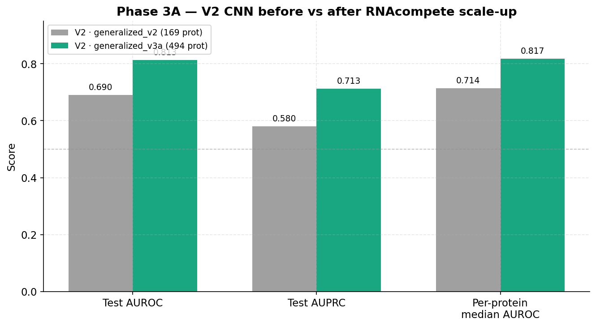
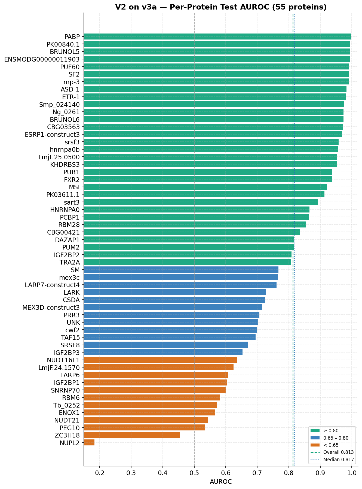
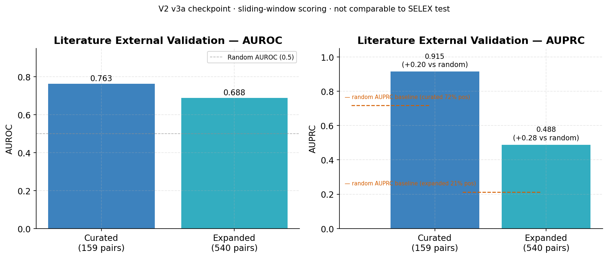
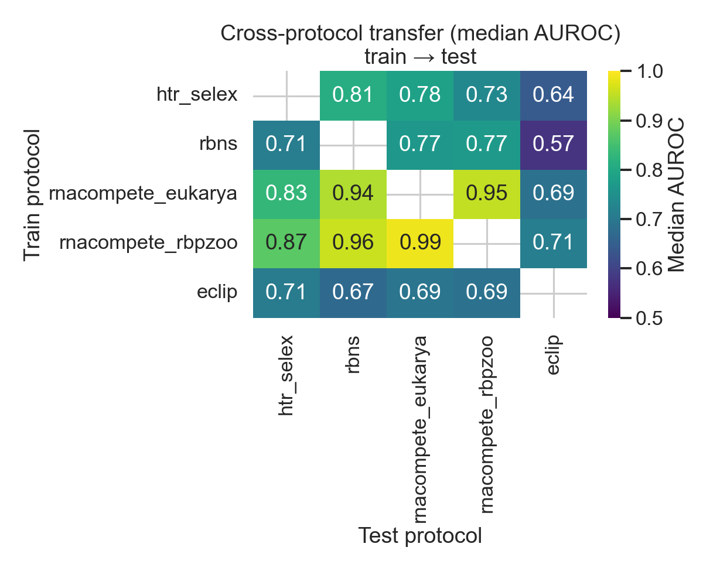

# Protein–RNA Binding Prediction

Machine learning pipeline for predicting whether an RNA-binding protein (RBP) binds a given RNA sequence. Training data come from large-scale **in vitro** assays (HTR-SELEX, RBNS, RNAcompete). Evaluation spans held-out protein splits, literature external pairs, and cross-protocol transfer for matched RBPs.

```
Input:  protein amino acid sequence + RNA nucleotide sequence
Output: binding probability ∈ [0, 1]
```

**Canonical metrics**: [`results/phase3b_summary.json`](results/phase3b_summary.json) · **Run history**: [`EXPERIMENT_LOG.md`](EXPERIMENT_LOG.md)

---

## Current Status

| Phase | Status | Headline result |
|---|---|---|
| Phase 1 — Per-dataset validation | **Complete** | All 3 SELEX datasets pass (val AUROC > 0.70) |
| Phase 2 — Generalized V1–V3c | **Complete** | V2 CNN anchor: test AUROC **0.690** on `generalized_v2` (169 proteins) |
| Phase 3A — V2 on `generalized_v3a` | **Complete** | Test AUROC **0.813**, AUPRC **0.713** (494 proteins, 2.66M pairs) |
| Phase 3B — V4 bilinear on v3a | **Complete** | Test AUROC **0.829 ± 0.009** (3 seeds); +0.016 vs V2 in-distribution |
| Phase 3B — Literature external | **Complete** | Curated AUROC **0.763** (V2) vs **0.737** (V4) — V2 better OOD |
| Cross-protocol in-vitro | **Complete** | k=4 LR transfer mean AUROC **0.791** vs within **0.974** (84 matched RBPs) |
| Domain-aware V2 | **Next** | `scripts/38` — baseline / domain-conditioned / shuffle |
| RNAcompete `rnacompete_all` zero-shot | **Historical only** | Valid for **V2 + `generalized_v2` only** — panels are **in v3a training** |

<details>
<summary>Documentation map</summary>

| Doc | Purpose |
|---|---|
| [`EXPERIMENT_LOG.md`](EXPERIMENT_LOG.md) | Chronological run record |
| [`PHASE3B_STATUS.md`](PHASE3B_STATUS.md) | Latest VM commands & sync steps |
| [`PHASE3A_PLAN.md`](PHASE3A_PLAN.md) | v3a dataset build (complete) |
| [`CROSS_ASSAY_PLAN.md`](CROSS_ASSAY_PLAN.md) | Cross-protocol → domain strategy |
| [`DATA_SOURCES_AND_DOWNLOADS.md`](DATA_SOURCES_AND_DOWNLOADS.md) | Sibling-repo paths & integrity checks |
| [`DATA.md`](DATA.md) | Provenance, leakage, negatives |
| [`METHODS.md`](METHODS.md) | Splits, metrics, references |
| [`STRATEGY.md`](STRATEGY.md) | Lessons learned, what not to repeat |
| [`strategy_dashboard.html`](strategy_dashboard.html) | Architecture & queue (HTML) |

Legacy: [`dashboard.html`](dashboard.html) — Phase 1–2 only, not updated for 3A/3B.

</details>

### Headline takeaways (2026-09)

1. **In-distribution (v3a test)**: V4 bilinear + source embedding beats V2 CNN (**0.829 ± 0.009** vs **0.813**).
2. **OOD (literature long-RNA)**: V2 still wins; V4 does not improve external generalization.
3. **Cross-assay**: For the same RBP, k-mer binding models transfer across HTR-SELEX / RBNS / RNAcompete with ~0.18 AUROC drop vs within-assay; RNAcompete panels transfer almost perfectly to each other.

---

## Phase 1 — Dataset Validation (Complete)

Three datasets validated independently with protein-aware train/test splits.
Baseline: LR / RF / XGBoost on k-mer features. A dataset passes if val AUROC > 0.70
on entirely unseen proteins.

| Dataset | Source | RBPs | Examples | Best val AUROC | Status |
|---|---|---|---|---|---|
| HTR-SELEX PRJEB25907 | Ray et al., *Genome Res.* 2019 | 93 | 279,000 | 0.825 (XGB) | Pass |
| RBNS | Lambert et al., *Nature* 2020 | 96 | 284,642 | 0.758 (RF) | Pass |
| HTR-SELEX PRJEB47428 | Laverty et al., *NAR* 2022 | 23 | 69,000 | 0.817 (LR) | Pass |

All splits are **protein-aware**: no RBP appears in both train and test. Combined training pool: 632,642 examples · 168 unique proteins.


---

## Phase 2 — Generalized Models (Complete)

All numbers from **clean checkpoints** retrained after fixing the double class-weighting bug (2026-05-13). Data: `generalized_v2` (HTR-SELEX + RBNS only).

| Model | Encoding | Val AUROC | Test AUROC | Test AUPRC | pp-median AUROC | Note |
|---|---|---|---|---|---|---|
| V1 MLP | RNA 4-mer + Prot 3-mer | 0.716 | 0.674 | 0.544 | 0.689 | |
| **V2 CNN** | One-hot sequences | **0.746** | **0.690** | **0.580** | **0.714** | **anchor architecture** |
| V3 ESM-2 mean-pool | Frozen ESM-2 1280-d + RNA CNN | 0.715 | 0.634 | 0.547 | 0.633 | worse than V2 |
| V3b CNN + ESM-2 | One-hot + frozen ESM-2 concat | 0.770 | 0.666 | 0.568 | 0.676 | |
| V3c ESM-2 residue | Per-residue ESM-2 → Conv1D | 0.745 | 0.685 | 0.595 | 0.711 | |

**Key finding**: frozen ESM-2 does not beat one-hot CNN. Bottleneck is interaction modeling and data scale, not protein representation alone.


---

## Phase 3A — Scaled Training (Complete)

Merged HTR-SELEX + RBNS + RNAcompete (Eukarya + RBPZoo full; ucRBP 23 only) into
`data/generalized_v3a/` with homology-aware protein splits. Retrained **V2 CNN**
(`prot_max=700`, same architecture as Phase 2).

| Split | Rows | Proteins |
|---|---|---|
| train | 2,037,593 | 393 |
| val | 299,131 | 49 |
| test | 322,275 | 55 |
| **Total** | **2,658,999** | **494** |

### V2 CNN on `generalized_v3a`

| Metric | `generalized_v2` (169 prot) | **`generalized_v3a` (494 prot)** |
|---|---|---|
| Val AUROC / AUPRC | 0.746 / — | **0.818 / 0.693** |
| Test AUROC / AUPRC | 0.690 / 0.580 | **0.813 / 0.713** |
| Per-protein median test AUROC | 0.714 | **0.817** (55 test proteins) |

 · 

```bash
python scripts/22a_prepare_rnacompete_training.py
python scripts/22_build_phase3a_dataset.py \
    --selex_dir data/generalized_v2 \
    --rnacompete data/benchmarks/rnacompete/rnacompete_training_phase3a.tsv \
    --homology_tsv results/homology/train_vs_rnacompete.tsv \
    --out_dir data/generalized_v3a

python scripts/06_train_generalized_v2.py \
    --data_dir data/generalized_v3a --prot_max 700 --epochs 60
python scripts/06_eval_generalized_v2_test.py \
    --data_dir data/generalized_v3a \
    --checkpoint models/saved/generalized_v2/best_model.pt \
    --prot_max 700
```

---

## Phase 3B — Interaction Model, External Eval, Cross-Protocol

### 3B.1 V4 bilinear CNN (`generalized_v3a`)

V4 adds a bilinear protein–RNA interaction layer and per-assay source embeddings on top of the V2 dual-branch CNN (`scripts/21`).

| Model | Test AUROC | Test AUPRC | Notes |
|---|---|---|---|
| V2 CNN (v3a, seed 42) | 0.813 | 0.713 | Phase 3A anchor |
| V4 concat_bi (seed 42) | 0.829 | 0.735 | P100 GPU |
| **V4 concat_bi (3 seeds)** | **0.829 ± 0.009** | **0.732 ± 0.011** | seeds 42, 0, 1 |

```bash
python scripts/21_train_generalized_v4_interaction.py \
    --data_dir data/generalized_v3a \
    --interaction concat_bi --use_source_emb \
    --prot_max 700 --batch_size 512

python scripts/18_run_multiseed.py \
    --script scripts/21_train_generalized_v4_interaction.py \
    --n_seeds 3 --output_dir results/multiseed/v4_concat_bi_v3a \
    --extra_args "--data_dir data/generalized_v3a --interaction concat_bi --use_source_emb --prot_max 700 --batch_size 512"
```

### 3B.2 Literature external validation

Manually curated pairs from literature Excel (159 usable curated; 540 expanded with generated negatives). **Not comparable to v3a test AUROC** — different RNA lengths, labels, and negative semantics. See `DATA.md §2.2`.

| Benchmark | V2 AUROC | V4 AUROC | V2 AUPRC | V4 AUPRC |
|---|---|---|---|---|
| Curated (159) | **0.763** | 0.737 | 0.915 | 0.890 |
| Expanded (540) | **0.688** | 0.666 | 0.488 | 0.341 |



```bash
python scripts/31_build_external_benchmark.py \
    --xlsx data/external/dataset_without_affinities.xlsx \
    --train_tsv data/generalized_v3a/train.tsv

python scripts/11_evaluate_external.py \
    --benchmark_tsv data/external/external_benchmark_curated.tsv \
    --v2_dir models/saved/generalized_v2 --prot_max 700

python scripts/21b_evaluate_external_v4.py \
    --checkpoint models/saved/generalized_v4_phase3a/best_model.pt \
    --benchmark_tsv data/external/external_benchmark_curated.tsv \
    --prot_max 700
```

### 3B.3 Cross-protocol in-vitro comparison

For **84 proteins** present in ≥2 of four in vitro protocols (HTR-SELEX, RBNS, RNAcompete Eukarya/RBPZoo), scripts 33–36 build a matched roster, fit k=4 logistic regression within and across protocols, and compare motif concordance.

| Metric | Value |
|---|---|
| Within-protocol mean AUROC | **0.974** |
| Cross-protocol transfer mean AUROC | **0.791** |
| Transfer pairs AUROC < 0.55 | 24 / 284 |
| Strongest cross-assay (zero RNA overlap) | RNAcompete RBPZoo → RBNS, median **0.961** |
| Weakest pair | RBNS → HTR-SELEX, median **0.703** |

Config: `configs/cross_protocol_invitro.yaml` (no eCLIP). Outputs: `results/cross_protocol_invitro/`, figures `figures/cross_protocol_*.png`.



```bash
# Requires sibling clean TSVs — see DATA_SOURCES_AND_DOWNLOADS.md
python scripts/33_build_cross_protocol_roster.py --config configs/cross_protocol_invitro.yaml
python scripts/34_cross_protocol_classifiers.py --config configs/cross_protocol_invitro.yaml
python scripts/35_cross_protocol_motif_concordance.py --config configs/cross_protocol_invitro.yaml
python scripts/36_visualize_cross_protocol.py --config configs/cross_protocol_invitro.yaml
```

**Next in this track**: domain-conditioned V2 (`scripts/38`) — see [`DOMAIN_AWARE_PLAN.md`](DOMAIN_AWARE_PLAN.md).

---

## Per-Assay Analysis Pipelines

These scripts characterize individual protocols and support cross-protocol work. They are **not** the main CNN training path.

### Top/bottom RNA examples (`scripts/24`, `29`)

5 motif-anchored positives + 5 motif-negative examples per RBP per protocol → `results/top_bottom_examples/all_protocols_summary.tsv`.

### RNA-only per-protein classifiers (`scripts/25`, `26`)

One RNA 4-mer model per protein (LR/RF). Honest 60/20/20 split. Median test AUROC ~0.95–0.99 within assay — expected for in vitro data.

| Dataset | Proteins | Median Test AUROC |
|---|---|---|
| HTR-SELEX | 93 | 0.949 |
| RBNS | 96 | 0.995 |
| RNAcompete Eukarya | 200 | 0.993 |
| RNAcompete RBPZoo | 174 | 0.990 |

Results: `results/rna_only_per_protein_honest/`

### RNAcompete intensity spectrum (`scripts/27`, `28`)

100 probes per protein across log-intensity percentiles. No significant correlation between protein length and mean positive intensity (Eukarya r = −0.05, RBPZoo r = −0.04).

<details>
<summary>Commands for per-assay pipelines</summary>

```bash
# Top/bottom (example: RNAcompete Eukarya)
python scripts/24_extract_top_bottom_examples.py --protocol rnacompete \
  --data_file ../rnacompete_analysis/eukarya/results/ml_dataset_eukarya_clean.tsv.gz \
  --kmer_dir ../rnacompete_analysis/eukarya/data/kmers \
  --dataset_label RNAcompete_Eukarya
python scripts/29_annotate_top_bottom_experiment_ids.py

# RNA-only per protein
python scripts/25_train_rna_only_per_protein.py \
    --data_file ../htr_selex_analysis/results/ml_dataset_simple_clean.tsv \
    --dataset htr_selex
python scripts/26_visualize_rna_only_results.py

# Intensity spectrum
python scripts/27_sample_rnacompete_intensity_spectrum.py \
    --data_file ../rnacompete_analysis/eukarya/results/ml_dataset_eukarya_clean.tsv.gz \
    --dataset rnacompete_eukarya --n_proteins 3
python scripts/28_visualize_intensity_spectrum.py
```

</details>

---

## RNAcompete Zero-Shot Benchmark (Historical — V2 only)

> **Do not use this section for v3a or V4 checkpoints.** Eukarya and RBPZoo full panels are included in `generalized_v3a` training. Evaluating `rnacompete_all` on v3a/V4 is **not** zero-shot.

For the **Phase 2 V2 checkpoint** trained on `generalized_v2` (169 proteins, SELEX + RBNS only), RNAcompete (~1,087 experiments, ~13.9M pairs) was used as a true held-out benchmark:

| Metric | V2 on `generalized_v2` |
|---|---|
| Overall AUROC | 0.571 |
| Per-protein median (715 unseen) | 0.549 |
| % proteins AUROC > 0.7 | 17.3% |

This motivated Phase 3A (add RNAcompete to training). See `PHASE3A_PLAN.md`.

```bash
python scripts/17_prepare_rnacompete_benchmark.py \
    --rnacompete_dir /path/to/rnacompete_analysis \
    --output_dir data/benchmarks/rnacompete

python scripts/20_evaluate_benchmark.py \
    --checkpoint models/saved/generalized_v2/best_model.pt \
    --benchmark data/benchmarks/rnacompete/rnacompete_all.tsv \
    --output_dir results/benchmarks/rnacompete_v2
```

---

## Reference Models

| Model | Method | Training data | Test AUROC | Test AUPRC | Split |
|---|---|---|---|---|---|
| **V4 concat_bi (v3a)** | CNN + bilinear + source_emb | SELEX + RBNS + RNAcompete | **0.829 ± 0.009** | **0.732 ± 0.011** | Protein-aware, 494 prot |
| **V2 CNN (v3a)** | Dual-branch one-hot CNN | SELEX + RBNS + RNAcompete | **0.813** | **0.713** | Protein-aware, 494 prot |
| V2 CNN (v2) | Dual-branch one-hot CNN | HTR-SELEX + RBNS | 0.690 | 0.580 | Protein-aware, 169 prot |
| ZHMolGraph | RNA-FM + ProtTrans + GNN | NPInter2 / RPI7317 | 0.798 | 0.820 | Hard (NPInter5) |

> ZHMolGraph trains on literature interaction databases; our models train on in vitro binding assays. AUROC numbers are aspirational references, not directly comparable tasks.

---

## Repository Structure

```
protein_rna_ml/
├── configs/
│   ├── generalized_model.yaml
│   ├── cross_protocol.yaml / cross_protocol_invitro.yaml
│   ├── htr_selex_validation.yaml, rbns_validation.yaml
│   └── rnacompete_benchmark.yaml
│
├── scripts/
│   ├── 01–03   Phase 1 validation
│   ├── 04–10   Phase 2 generalized V1–V3c
│   ├── 11, 21b Literature external eval (V2 / V4)
│   ├── 17, 20  RNAcompete benchmark prep + eval (V2 historical)
│   ├── 18        Multi-seed runner
│   ├── 21–22     V4 training + v3a dataset build
│   ├── 24–29     Top/bottom examples, RNA-only baselines
│   ├── 31–32     External benchmark build + Phase 3A figures
│   ├── 33–36     Cross-protocol roster, classifiers, motifs, figures
│   ├── 37–38     Domain annotation + domain-conditioned V2
│   └── 40        Protein sequence sanitization QC
│
├── src/          data loaders, models (V2 CNN, V4 interaction)
├── results/
│   ├── phase3a_summary.json, phase3b_summary.json
│   ├── cross_protocol_invitro/     Cross-protocol metrics (3B)
│   ├── generalized/, external/, multiseed/
│   └── rna_only_per_protein_honest/, top_bottom_examples/
│
├── DATA.md, METHODS.md, STRATEGY.md, EXPERIMENT_LOG.md
├── CROSS_ASSAY_PLAN.md, DOMAIN_AWARE_PLAN.md
├── PHASE3A_PLAN.md, PHASE3B_STATUS.md
└── run_pipeline.sh
```

Sibling repos (not in this git repo): `../htr_selex_analysis/`, `../rbns_analysis/`, `../rnacompete_analysis/`. See [`DATA_SOURCES_AND_DOWNLOADS.md`](DATA_SOURCES_AND_DOWNLOADS.md).

---

## Quick Start

```bash
pip install -r requirements.txt

# Phase 1: validate one dataset
python scripts/02_train_validation_model.py --config configs/rbns_validation.yaml
python scripts/03_evaluate_validation.py --config configs/rbns_validation.yaml --model xgboost

# Phase 2 V2 on generalized_v2
python scripts/04_build_generalized_dataset.py
python scripts/06_train_generalized_v2.py --data_dir data/generalized_v2 --epochs 50

# Phase 3A: build v3a + train V2 (data not in git — see PHASE3A_PLAN.md)
# Phase 3B: V4 + cross-protocol (see sections above)

# Regenerate committed figures from JSON
python scripts/32_visualize_phase3a_results.py
python scripts/19_compare_models.py --results_dir results/generalized
```

---

## Key Design Decisions

- **Protein-aware split**: no RBP in more than one split. See `METHODS.md §3`.
- **Primary metric: AUPRC** under ~1:2 class imbalance; AUROC reported for comparability.
- **CNN over k-mer MLP**: global max pooling is length-agnostic (RBNS 20 nt vs HTR-SELEX 40 nt).
- **Frozen ESM-2 does not help** on 169-protein v2 data (V3/V3b/V3c).
- **RNAcompete in training (v3a)**: Eukarya + RBPZoo full panels + ucRBP 23; homology-aware splits. Full-panel `rnacompete_all` eval is invalid for v3a/V4 checkpoints.
- **Cross-protocol matching**: representative native name per protocol, exact equality only — constructs never pooled (`scripts/33–34`).

---

## References

- Ray et al. (2019). *Genome Research* — HTR-SELEX PRJEB25907
- Lambert et al. (2020). *Nature* — RBNS
- Laverty et al. (2022). *Nucleic Acids Research* — HTR-SELEX PRJEB47428
- Sasse et al. (2025). *Nature Biotechnology* — RBPZoo / EuPRI RNAcompete
- Ray et al. (2013). *Nature* — RNAcompete eukarya panel
- Liu et al. (2025). *Communications Biology* — ZHMolGraph
- Lin et al. (2023). *Science* — ESM-2
