# Protein–RNA Binding Prediction

Machine learning pipeline for predicting whether an RNA-binding protein (RBP) binds a given RNA sequence. Trained across multiple large-scale in vitro binding assays (HTR-SELEX, RBNS), with an independent zero-shot benchmark on RNAcompete (1,087 RBPs, 26 organisms).

```
Input:  protein amino acid sequence + RNA nucleotide sequence
Output: binding probability ∈ [0, 1]
```

---

## Current Status

| Phase | Status | Notes |
|---|---|---|
| Phase 1 — Dataset validation | **Complete** | 3 datasets, all pass |
| Phase 2 — Generalized models V1–V3c | **Complete** | Clean results, double class-weighting bug fixed and retrained 2026-05-13 |
| RNAcompete benchmark prep | **Complete** | 13.9M pairs processed |
| Zero-shot evaluation on RNAcompete (V2) | **Complete** | Median AUROC 0.549 on unseen proteins |
| Phase 3A — Expand training with RNAcompete | **In progress** | Dataset builder ready (`scripts/22`) |
| Phase 3B — V4 bilinear interaction layer | **In progress** | Model and training script ready (`scripts/21`) |

---

## Phase 1 — Dataset Validation (Complete)

Three datasets validated independently with protein-aware train/test splits.
Baseline: LR / RF / XGBoost on k-mer features. A dataset passes if val AUROC > 0.70
on entirely unseen proteins.

| Dataset | Source | RBPs | Examples | Best val AUROC | Status |
|---|---|---|---|---|---|
| HTR-SELEX PRJEB25907 | Ray et al., *Genome Res.* 2019 | 93 | 279,000 | 0.825 (XGB) | Pass |
| RBNS | Lambert et al., *Nature* 2020 | 96 | 284,642 | 0.758 (RF) | Pass |
| HTR-SELEX PRJEB47428 | Laverty et al., *NAR* 2022 | 23 | 69,000 | 0.817 (LR) | Pass |

All splits are **protein-aware**: no RBP appears in both train and test. Combined training pool: 632,642 examples · 168 unique proteins.

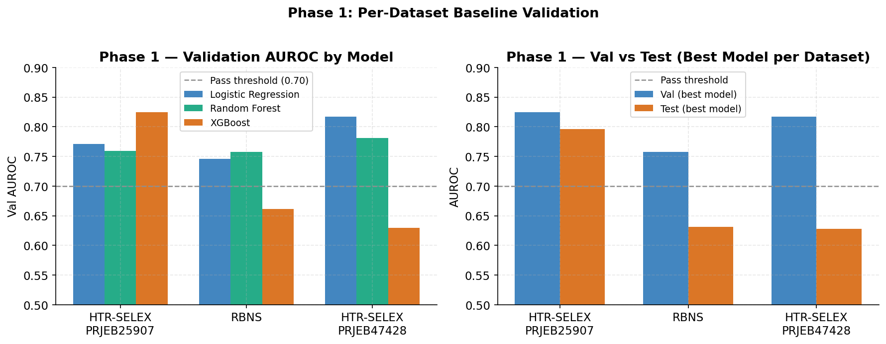

---

## Phase 2 — Generalized Models

All numbers below are from **clean checkpoints** retrained after fixing the double class-weighting bug (2026-05-13).

| Model | Encoding | Val AUROC | Test AUROC | Test AUPRC | pp-median AUROC | Note |
|---|---|---|---|---|---|---|
| V1 MLP | RNA 4-mer + Prot 3-mer | 0.716 | 0.674 | 0.544 | 0.689 | |
| **V2 CNN** | One-hot sequences | **0.746** | **0.690** | **0.580** | **0.714** | **anchor model** |
| V3 ESM-2 mean-pool | Frozen ESM-2 1280-d + RNA CNN | 0.715 | 0.634 | 0.547 | 0.633 | **worse than V2** |
| V3b CNN + ESM-2 | One-hot + frozen ESM-2 concat | 0.770 | 0.666 | 0.568 | 0.676 | |
| V3c ESM-2 residue | Per-residue ESM-2 → Conv1D | 0.745 | 0.685 | 0.595 | 0.711 | |

**Key finding**: frozen ESM-2 embeddings (mean-pool and residue) do not improve over pure one-hot CNN. The bottleneck is interaction modeling and data quality, not protein representation.

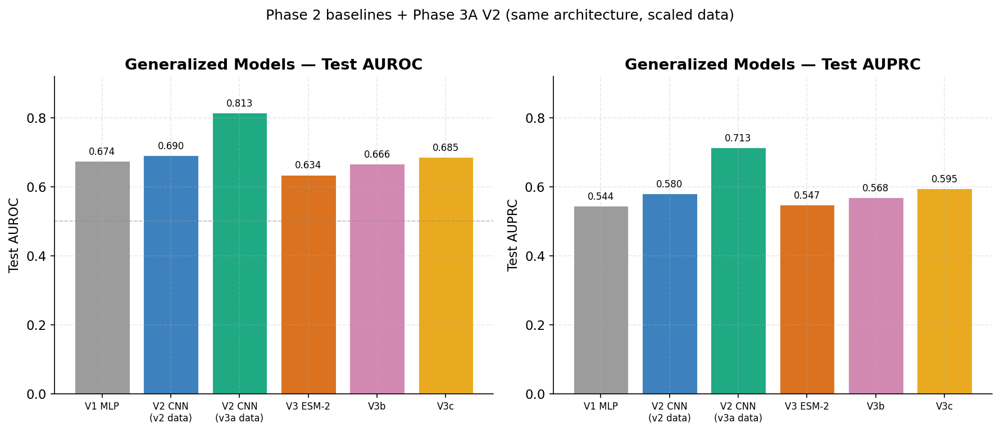

<details>
<summary>Training dynamics and per-protein breakdown (V2 CNN)</summary>

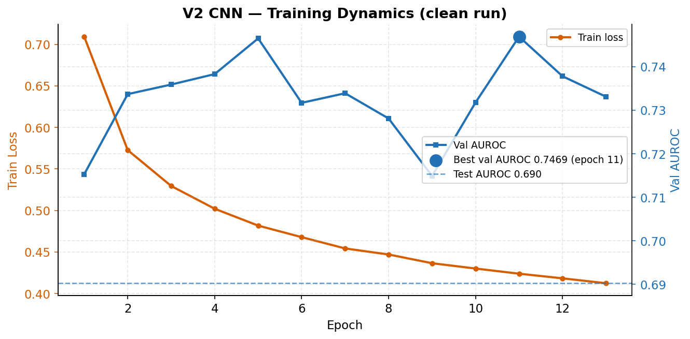

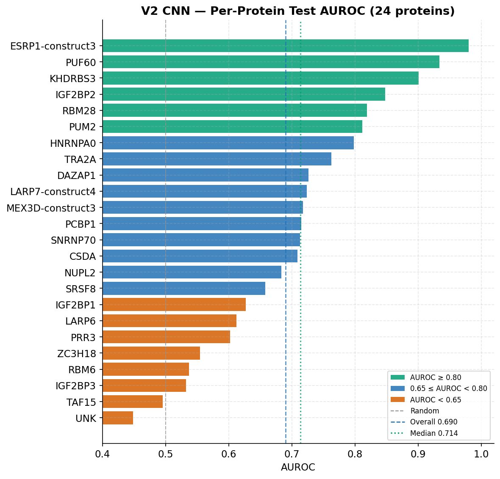

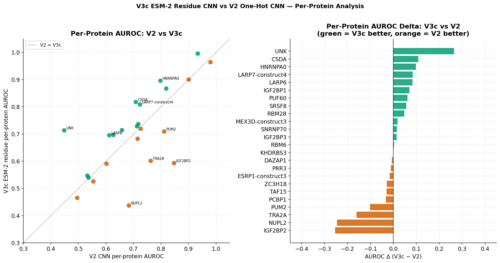

</details>

---

## RNAcompete Benchmark (Zero-Shot Evaluation)

RNAcompete (Sasse et al., *Nat. Biotechnol.* 2025 + Ray et al., *Nature* 2013) measures in vitro RNA-binding specificity of recombinant RBPs against a pool of ~241,000 synthetic RNA probes (35–41 nt). Three sub-datasets aggregated:

| Sub-dataset | Experiments | Pairs | Organisms |
|---|---|---|---|
| RBPZoo (Sasse et al. 2025) | 176 | 2,592,720 | 26 |
| Eukarya (Ray 2013) | 244 | 3,726,353 | 24 |
| ucRBP (Hughes Lab) | 667 | 7,584,616 | 4 |
| **Combined** | **1,087** | **~13.9M** | **~26** |

**Integration strategy: benchmark only (not training).** Models trained on HTR-SELEX + RBNS are evaluated on RNAcompete without fine-tuning — a zero-shot generalization test across unseen proteins, organisms, and assay technology. Merging into training is deferred to Phase 3 pending homology analysis.

### Zero-Shot Results — V2 CNN (clean checkpoint, 2026-05-13)

| Metric | Value | Notes |
|---|---|---|
| Overall AUROC | 0.571 | vs random 0.500 |
| Per-protein median (all 742) | 0.551 | |
| Per-protein median — **truly unseen** (715) | **0.549** | 27 proteins overlap with training |
| Per-protein median — seen in training (27) | 0.629 | memorization benefit only +0.08 |
| Human RBPs / ucRBP (613 proteins) | 0.554 | 1.45M pairs, near-random |
| % proteins AUROC > 0.7 | 17.3% | |

**Interpretation**: zero-shot generalization fails on this checkpoint.
The bottleneck is the size and diversity of the training set (169 proteins), not architecture.
The 0.08 gap between seen and unseen proteins shows minimal memorization.
Phase 3 (expanding training with RNAcompete + bilinear interaction layer) addresses both issues.
See `STRATEGY.md §8` for the full plan.

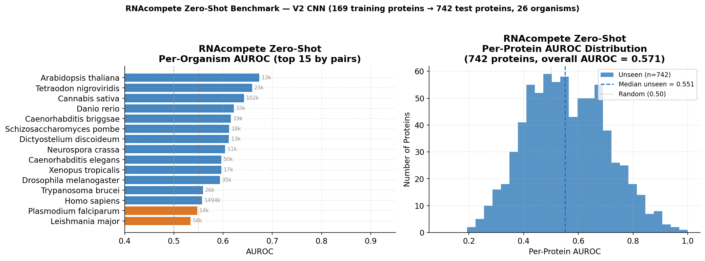

```bash
# Step 1 — prepare benchmark files (once, re-run after organism name fix):
python scripts/17_prepare_rnacompete_benchmark.py \
    --rnacompete_dir /path/to/rnacompete_analysis \
    --output_dir data/benchmarks/rnacompete

# Step 2 — evaluate trained model (after each checkpoint):
python scripts/20_evaluate_benchmark.py \
    --checkpoint models/saved/generalized_v2/best_model.pt \
    --benchmark  data/benchmarks/rnacompete/rnacompete_all.tsv \
    --output_dir results/benchmarks/rnacompete_v2
```

---

## Top/Bottom RNA Examples

Script `24_extract_top_bottom_examples.py` selects **5 highest-confidence positives** and **5 strongest negatives** per RBP, anchored on the top-10 enriched 7-mers.

| Protocol | Dataset | Proteins | Examples |
|---|---|---|---|
| HTR-SELEX | PRJEB25907 | 93 | 927 |
| RBNS | Lambert 2020 | 96 | 960 |
| RNAcompete | Eukarya (Ray 2013) | 200 | 2,000 |
| RNAcompete | RBPZoo (Sasse 2025) | 174 | 1,740 |
| RNAcompete | ucRBP23 (Ray & Laverty 2023) | 23 | 230 |
| **Combined** | | **586** | **5,857** |

RNAcompete positives require a top-10 7-mer match + modal probe length (from positives); negatives have no top-10 7-mer at the same length. When multiple experiments exist per protein, the best experiment is selected (highest mean positive intensity).

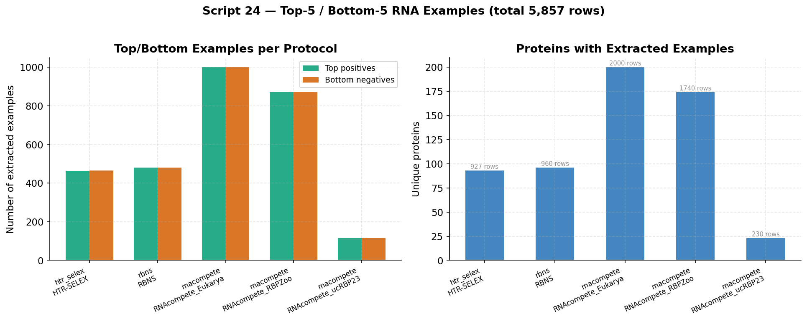

```bash
# HTR-SELEX + RBNS + RNAcompete Eukarya (default output dir)
python scripts/24_extract_top_bottom_examples.py --protocol all

# RBPZoo (Z-score matrix) and ucRBP23 whitelist
python scripts/24_extract_top_bottom_examples.py --protocol rnacompete_rbpzoo \
    --zscore_file /path/to/Zscores_RNAcompete2025.txt.gz
python scripts/24_extract_top_bottom_examples.py --protocol rnacompete_ucrbp --ucrbp_mode
```

Output: `results/top_bottom_examples/all_protocols_summary.tsv` (master file with `protocol`, `dataset`, `matched_kmer`, `kmer_position`).

---

## RNA-Only Per-Protein Classifiers

Per-protein baseline: **one RNA 4-mer model per protein**, no protein features. Compares Logistic Regression vs Random Forest on the original `*_clean.tsv` files (not the top/bottom summary).

**Evaluation (default `--honest`)**: dedupe by `rna_sequence`, stratified 60/20/20 train/val/test, model picked on validation, **metrics reported on held-out test** (AUROC + AUPRC). RNAcompete uses best-experiment selection + modal length from train only.

| Dataset | Proteins | Median Test AUROC | Median Test AUPRC | Best Model |
|---|---|---|---|---|
| HTR-SELEX | 93 | **0.949** | **0.927** | RF (73/93 wins) |
| RBNS | 96 | **0.995** | **0.985** | RF (79/96 wins) |
| RNAcompete Eukarya | 200 | **0.993** | **0.985** | RF (137/200 wins) |
| RNAcompete RBPZoo | 174 | **0.990** | **0.974** | RF (153/174 wins) |

~20 HTR-SELEX proteins have test AUROC < 0.90 (worst: MEX3D-construct3 ≈ 0.71). RBNS has one borderline protein (IGF2BP3 ≈ 0.90). RNAcompete panels are near-saturated.

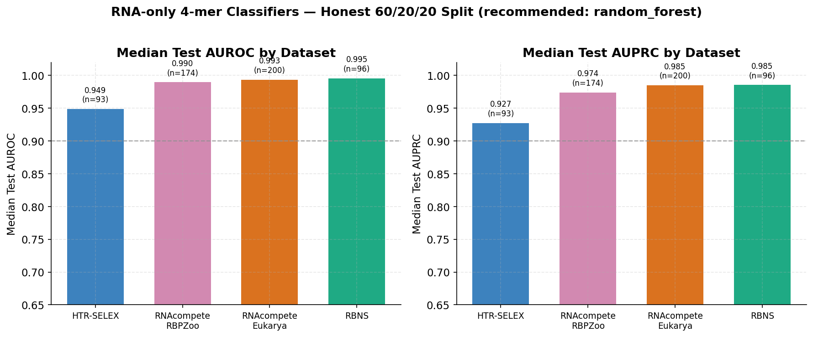

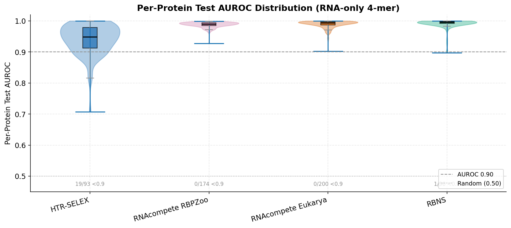

<details>
<summary>Model comparison and weakest proteins</summary>

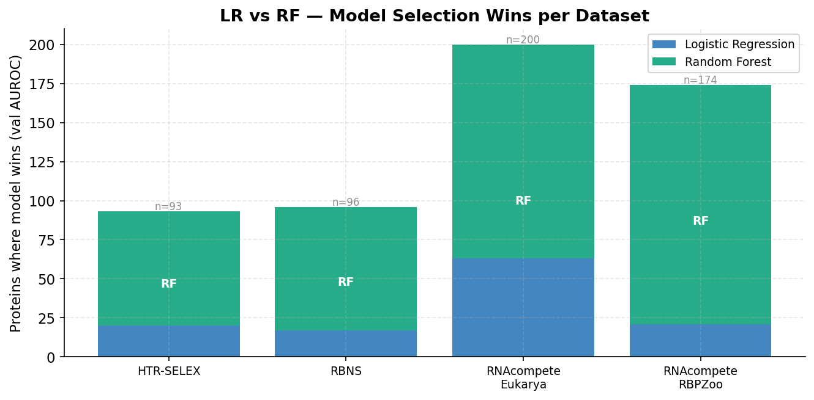

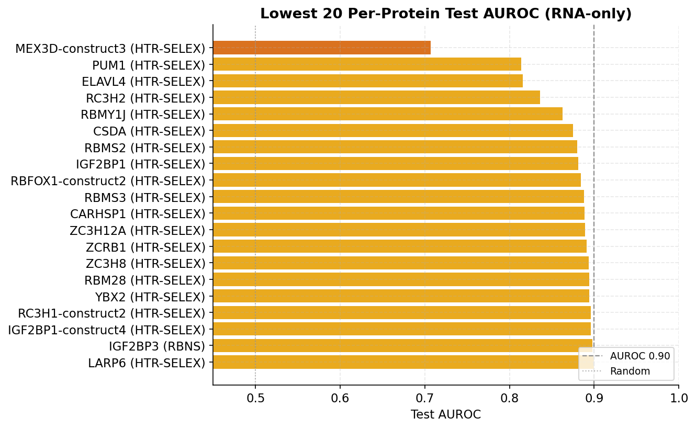

</details>

```bash
# Train on one dataset (honest split, summaries only — no model pickles by default)
python scripts/25_train_rna_only_per_protein.py \
    --data_file ../htr_selex_analysis/results/ml_dataset_simple_clean.tsv \
    --dataset htr_selex

python scripts/25_train_rna_only_per_protein.py \
    --data_file ../rnacompete_analysis/eukarya/results/ml_dataset_eukarya_clean.tsv.gz \
    --dataset rnacompete_eukarya --rnacompete_best_experiment

# Regenerate figures
python scripts/26_visualize_rna_only_results.py
```

Results: `results/rna_only_per_protein_honest/` (`*_stats.json`, `*_per_protein_metrics.tsv`, `all_datasets_summary.tsv`).

> **Interpretation**: high AUROC is expected for per-protein k-mer models on in vitro assays. RNAcompete labels partly overlap with 7-mer enrichment (dual filter) → more circular than SELEX/RBNS. Test set uses sequence only — no label leakage at inference.

---

## Reference Models

| Model | Method | Dataset | AUROC | AUPRC | Split |
|---|---|---|---|---|---|
| **Our V2 CNN** | Dual-branch one-hot CNN | HTR-SELEX + RBNS | 0.690 | 0.580 | Protein-aware |
| Our XGBoost | k-mer features per-dataset | HTR-SELEX only | 0.825 | 0.742 | Protein-aware |
| ZHMolGraph | RNA-FM + ProtTrans + GNN | NPInter2 / RPI7317 | 0.798 | 0.820 | Hard (NPInter5) |
| RPITER | Feature refinement + RF | Various | 0.727 | 0.774 | Random |
| IPMiner | Autoencoder + DBN | Various | 0.664 | 0.742 | Random |

> **On ZHMolGraph comparability**: ZHMolGraph was trained on curated literature-derived
> interaction databases (NPInter2, RPI7317) and evaluated on unseen pairs from NPInter5.
> Our project trains on in vitro binding assays (HTR-SELEX, RBNS). These are different
> biological tasks with different data sources and negative sampling. AUROC 0.798 is an
> aspirational reference, not a directly comparable number.

---

## Repository Structure

```
protein_rna_ml/
│
├── configs/
│   ├── generalized_model.yaml
│   ├── htr_selex_validation.yaml
│   ├── htr_selex_prjeb47428_validation.yaml
│   ├── rbns_validation.yaml
│   └── rnacompete_benchmark.yaml       ← benchmark config + dataset roadmap
│
├── scripts/
│   │   — Phase 1: per-dataset validation —
│   ├── 01_prepare_dataset.py           encode + split one dataset
│   ├── 01_prepare_htr_selex.py         HTR-SELEX-specific preparation
│   ├── 02_train_validation_model.py    LR / RF / XGBoost baseline
│   ├── 03_evaluate_validation.py       test-set eval + plots
│   │
│   │   — Phase 2: generalized models —
│   ├── 04_build_generalized_dataset.py merge all validated datasets
│   ├── 05_train_generalized_v1.py      V1: MLP on k-mer features
│   ├── 06_train_generalized_v2.py      V2: dual-branch CNN (anchor model)
│   ├── 07_extract_esm2_embeddings.py   extract ESM-2 mean-pool embeddings
│   ├── 07b_extract_esm2_residues.py    extract ESM-2 per-residue embeddings
│   ├── 08_train_generalized_v3.py      V3: frozen ESM-2 + RNA CNN
│   ├── 09_train_generalized_v3b.py     V3b: one-hot CNN + frozen ESM-2 concat
│   ├── 10_train_generalized_v3c.py     V3c: per-residue ESM-2 → Conv1D
│   │
│   │   — Data acquisition —
│   ├── 11_evaluate_external.py         external validation with integrity checks
│   ├── 12_download_eclip.py            download eCLIP datasets from ENCODE
│   ├── 13_download_rnainter.py         download RNAInter interaction data
│   ├── 14_merge_new_data.py            merge new datasets into training pool
│   │
│   │   — Analysis & visualization —
│   ├── 15_analyze_training.py          loss/AUROC curves, per-protein violin, heatmap
│   ├── 16_analyze_predictions.py       sequence diagnostics, calibration, FP/FN motifs
│   │
│   │   — RNAcompete benchmark —
│   ├── 17_prepare_rnacompete_benchmark.py  convert 3 sub-datasets to project schema
│   ├── 20_evaluate_benchmark.py            inference on any benchmark TSV with saved model
│   │
│   │   — Phase 3: scaling + interaction —
│   ├── 21_train_generalized_v4_interaction.py  V4: bilinear interaction layer
│   ├── 22_build_phase3a_dataset.py             SELEX + RNAcompete merge (homology-aware)
│   │
│   │   — Example extraction & RNA-only baselines —
│   ├── 24_extract_top_bottom_examples.py   top-5/bottom-5 RNA per RBP (7-mer anchored)
│   ├── 25_train_rna_only_per_protein.py    per-protein RNA 4-mer LR/RF classifiers
│   └── 26_visualize_rna_only_results.py    figures for scripts 24–25
│   │
│   │   — Experiment infrastructure —
│   ├── 18_run_multiseed.py             multi-seed runner, mean±std aggregation
│   ├── 19_compare_models.py            leaderboard, radar chart, CDF comparison
│   └── 23_generate_readme_figures.py     Phase 1–2 + RNAcompete README figures
│
├── src/
│   ├── data/
│   │   ├── dataset.py                  KmerDataset, SeqDataset (PyTorch)
│   │   ├── loaders.py                  unified loader API for all data sources
│   │   ├── preprocessing.py            k-mer encoding, one-hot
│   │   └── splits.py                   protein-aware splitting
│   ├── models/
│   │   ├── baseline.py                 LR / RF / XGBoost wrappers
│   │   ├── mlp_model.py                RNABindingMLP
│   │   ├── cnn_model.py                RNABindingCNN (dual-branch, V2)
│   │   └── interaction_model.py        RNABindingV4 (bilinear interaction, Phase 3B)
│   └── utils/
│       └── __init__.py
│
├── results/
│   ├── phase1_summary.json
│   ├── phase2_summary.json
│   ├── generalized/                    V1–V3c result JSONs
│   ├── htr_selex/
│   ├── rbns/
│   ├── htr_selex_prjeb47428/
│   ├── top_bottom_examples/            script 24 outputs + all_protocols_summary.tsv
│   └── rna_only_per_protein_honest/      script 25 honest-split metrics (no .pkl)
│
├── tasks/
│   ├── todo.md
│   ├── TASKS_AND_DATASETS.md
│   └── NEXT_SESSION_PROMPT.md          context prompt for new sessions
│
├── DATA.md                             dataset provenance, leakage risks, negatives
├── METHODS.md                          methodological choices + references
├── STRATEGY.md                         experiment state, lessons learned, what not to do
├── EXPERIMENT_LOG.md                   chronological run history V1→V3c
└── run_pipeline.sh                     end-to-end pipeline runner
```

---

## Quick Start

```bash
pip install -r requirements.txt

# Phase 1: validate one dataset
python scripts/01_prepare_dataset.py --config configs/rbns_validation.yaml
python scripts/02_train_validation_model.py --config configs/rbns_validation.yaml
python scripts/03_evaluate_validation.py --config configs/rbns_validation.yaml --model xgboost

# Phase 2 V2: train CNN (clean, bug fixed)
python scripts/04_build_generalized_dataset.py
python scripts/06_train_generalized_v2.py --data_dir data/generalized_v2 --epochs 50

# Multi-seed evaluation (5 seeds). Each seed writes results to
# results/multiseed/v2_cnn/seed_<N>/ and checkpoints to seed_<N>/checkpoints/.
python scripts/18_run_multiseed.py \
    --script scripts/06_train_generalized_v2.py \
    --n_seeds 5 --output_dir results/multiseed/v2_cnn \
    --extra_args "--data_dir data/generalized_v2 --epochs 50"
# Append --live to stream epoch logs to the terminal (still written to seed_N/train.log).

# Analyze training dynamics
python scripts/15_analyze_training.py --results_dir results/generalized

# Model leaderboard
python scripts/19_compare_models.py --results_dir results/generalized

# RNAcompete zero-shot benchmark
python scripts/17_prepare_rnacompete_benchmark.py \
    --rnacompete_dir /path/to/rnacompete_analysis \
    --output_dir data/benchmarks/rnacompete
python scripts/20_evaluate_benchmark.py \
    --checkpoint models/saved/generalized_v2/best_model.pt \
    --benchmark data/benchmarks/rnacompete/rnacompete_all.tsv \
    --output_dir results/benchmarks/rnacompete_v2

# Phase 3B: V4 bilinear interaction model
python scripts/21_train_generalized_v4_interaction.py \
    --data_dir data/generalized_v2 \
    --interaction concat_bi \
    --out_dir results/generalized/v4_bilinear \
    --model_dir models/saved/generalized_v4
```

---

## Key Design Decisions

- **Protein-aware split**: no RBP in more than one split; mirrors real deployment (novel protein). See `METHODS.md §3`.
- **Primary metric: AUPRC** — more informative than AUROC under 1:2 class imbalance.
- **Negative sampling**: non-enriched sequences from the same SELEX pool (same GC/length distribution as positives). Not random — biologically motivated.
- **CNN over k-mer MLP**: dual-branch 1D conv with global max pooling is length-agnostic, resolving the 20 nt (RBNS) vs 40 nt (HTR-SELEX) length mismatch.
- **Frozen ESM-2 does not help**: three experiments (V3, V3b, V3c) confirm no gain over one-hot CNN. Bottleneck is interaction modeling, not protein representation.
- **RNAcompete as benchmark**: 1,087 proteins across 26 organisms used for zero-shot evaluation only. Merging into training requires homology analysis and domain-aware protein encoder first.

## References

- Ray et al. (2019). *Genome Research* — HTR-SELEX PRJEB25907
- Lambert et al. (2020). *Nature* — RBNS dataset
- Laverty et al. (2022). *Nucleic Acids Research* — HTR-SELEX PRJEB47428
- Sasse et al. (2025). *Nature Biotechnology* — RBPZoo / EuPRI RNAcompete
- Ray et al. (2013). *Nature* — RNAcompete eukarya panel
- Liu et al. (2025). *Communications Biology* — ZHMolGraph (NPInter2/RPI7317 benchmark)
- Lin et al. (2023). *Science* — ESM-2 protein language model
